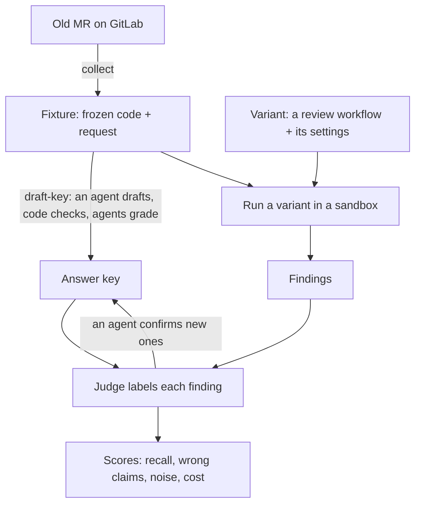

# Replay old MRs as review tests with an answer key

## Outcome

We want to know whether one way of reviewing code finds more real problems than another, with less
noise and at lower cost. For that we need examples where we already know the answers.

A **fixture** is one such example: an old merge request (MR; a pull request on GitHub) frozen at the
moment review started, plus an **answer key** of the real problems found in it, each graded by how
serious it is and what kind it is. We run a review on the frozen code, then check what it caught,
what it got wrong, and what it added.

This story defines the format and the tools that build fixtures from any GitLab project. The first
collector is for GitLab; the format names its forge, so a GitHub collector can follow. Fixtures live
outside this repository, because a project's code and review comments are usually private.

Why now: we record what a run costs (story 002), but not whether the review was any good. Three
planned pieces read this format, so it comes first:

- the scorer ([`review-recall-scorer`](todo/review-recall-scorer.md));
- the sandboxing that hides the answers from the reviewer ([`eval-isolation`](todo/eval-isolation.md));
- the runner that tries review variants across many fixtures
  ([`variant-matrix-runner`](todo/variant-matrix-runner.md)).

## Scope

In: the format, its checker, `collect` for GitLab, `draft-key`, and a first set built and checked.

Out: scoring, handing a fixture to a reviewer safely, a GitHub collector, and bugs nobody raised
during review (they join the key later, see [[#From an MR to a score|From an MR to a score]]).

## What we learned

We built five fixtures by hand from one private GitLab project. Counts and details are in
[`research/review-fixtures.md`](../research/review-fixtures.md); the fixtures are in that
project's workflows repository. How other benchmarks, eval frameworks and industry teams
do this, and what we borrowed, is in
[`research/review-eval-prior-art.md`](../research/review-eval-prior-art.md).

1. **The final MR description gives answers away.** Authors add notes about the fixes, and bots
   paste review summaries in. So we use the description as it was when review started, with the
   bot text removed.
2. **GitLab forgets things.** It deletes old diffs after a merge, and it moves comments to the
   newest version. Old commits can still be fetched, but nothing promises they'll stay. So each
   fixture keeps its own copy of the code.
3. **A later fix doesn't prove the problem was there at the start.** Some problems were raised on
   later versions, and we had to check that they also existed in the frozen code.
4. **One comment often makes several points,** and each can end differently.
5. **Most known problems came from an earlier AI review.** That's fine: a real problem is real
   whoever raised it. But a key built this way misses what that review never looked for, so the
   key has to grow when a new reviewer finds something real.
6. **Building a key takes judgement.** A fixture took 70–90 minutes by hand, and most of that was
   deciding things, not fetching them.

## How it works

### A fixture

An MR is a branch that gets pushed several times. Review starts on one of those pushes, and the
author keeps pushing as comments come in:

```text
main ──●──●──●── base
                  ╲
                   c1──c2──c3 = head        ← the last push before the first review comment
                                  ╲
                                   v2 ── v3 ── … ── vN   ← later pushes, answering the review
```

A fixture freezes the MR at `head` and splits what it knows into two halves:

- **What the reviewer gets:** the code at `head` with its real history (`snapshot.bundle`), and
  the title and description as they read when review started (`request.md`). The change under
  review is the whole diff `base..head`, however many commits it took. The history lets
  `git log` and `git blame` work, as they did for the human reviewer. The bundle holds only what
  `main` lacks, so a clone of `main` plus the bundle restores it, even after the branch was
  rebased or deleted.
- **What only the key sees:** the later pushes (`key/fixes.bundle`), the raw comments, and the
  answer key itself. The later pushes are how we know a comment was right: the author changed the
  code it pointed at. They also show fixes nobody commented on.

A problem that only exists in a later push can't be found by reviewing `head`, so it isn't in the
key. It is recorded as excluded (`not-in-snapshot`), and a reviewer is neither credited nor
penalised for it. To test a later round of review, freeze the MR at that push as a fixture of its
own.

### From an MR to a score



1. **Build.** `collect` fetches an MR and freezes it at the version review started on. `draft-key`
   drafts the answer key from the MR's comments and fixes, code checks it, and blind agent graders
   settle each severity.
2. **Run.** A **variant** is one way of reviewing: any workflow, plus the arguments that configure
   it (models, prompts, checklists, how many agents). A single agent with a short prompt is a
   variant; a fan-out over many checklists with a verifier per finding is another. The runner
   restores the fixture in a sandbox, runs the variant, and turns its output into a common list of
   findings.
3. **Score.** A judge matches each finding to the key by what goes wrong, not by wording or line,
   and labels it. The labels are defined in [`review-recall-scorer`](todo/review-recall-scorer.md).
4. **Grow the key.** A finding that's real but not in the key is labelled `new`. An agent
   confirms it, and it joins the key with the run as its source. Older runs are then re-scored
   against the new revision, so a variant that finds what the old review missed isn't penalised.
5. **Compare.** The matrix runner repeats this across variants and fixtures. Each variant records
   what it was tuned on. The fixtures it was never tuned on are its **holdout**: the fair test.

## Code map

- `packages/autoresearch/src/review/`:
  - pure: `format.ts` (the TypeBox schemas, the single definition of every file; `schema/` is
    generated from it by `src/write-schemas.ts`), `validate.ts` (the checks, including a key
    against its fixture and a key against its votes), `review-start.ts` (which push review started
    on), `description.ts` (the description as it read then, bot text removed), `threads.ts` (the
    comments as the drafter reads them), `grading.ts` (the rubric), `gitlab-types.ts`;
  - I/O: `gitlab.ts` (`glab api`, read-only), `git.ts` (bundling, and the `restore`
    eval-isolation will reuse), `collect.ts`, `draft-key.ts` (the drafter and the graders' vote),
    `verify.ts` (checks a fixture folder end to end), and `fixtures.workflow.ts`, which runs collect
    and draft-key over a list of MRs.
- `packages/autoresearch/AGENTS.md`: the package's rules.
- `scripts/check-boundaries.ts`: rules for the new package; every file in `src/review/` is pure
  unless named as I/O.
- `examples/catalogue-review/schema.ts` and `examples/minimum-review/workflow.ts`: two review
  workflows with different finding shapes; the first variants to read into `ReviewFinding`.
- `docs/foundation.md` §7, `AGENTS.md`, and
  [ADR 0003](../adr/0003-autoresearch-tools-here-project-data-there.md): where the package and the
  split are recorded.

## The design

### Where it lives

**Two places.** The general tools go in a new package in this repository. Everything about one
project goes in that project's own workflows repository.

- **`packages/autoresearch`** (this repository): the fixture format and checker, `collect`,
  `draft-key`, and later the scorer and runner. It's a package, not a folder, because a project's
  workflows repository has to import it to build and score its own fixtures. That's the trigger
  [ADR 0002](../adr/0002-autoresearch-lives-here.md) set for a package.
- **Why not all of it here:** a project's review workflow, its checklists and its data are that
  project's, and often private. They already live in its own repository, which imports awf's
  example workflows. Tuning them there keeps this repository free of any one project.
  ADR 0002 assumed the workflows being tuned would live here;
  [ADR 0003](../adr/0003-autoresearch-tools-here-project-data-there.md) records the split.
- **Not `contract`.** The engine never reads fixtures, and the format is specific to code review
  and will change a few times before it settles. It shouldn't be in the package every other
  package depends on.
- **A project's workflows repository**: its variants (its own review workflow and checklists), its
  fixture sets themselves (under `autoresearch/fixtures/<set>/`, versioned, so key changes have
  history), which fixtures each variant was tuned on, and any script
  that reads that project's own review notes into a fixture's evidence.

It starts optimised for code review. Two pieces are general from the start, because they don't
depend on what's being tested: a set of fixtures (`FixtureSet`) and a variant (`Variant`).

### Files

```text
<root>/<set>/
  set.json              which fixtures are in the set, their hashes, and which MRs were left out and why
  <fixture-id>/
    request.md          the title and description: all the reviewer reads
    snapshot.bundle     the frozen code (git bundle)
    fixture.json        where the MR came from and the frozen version
    key/                never enters the reviewer's sandbox
      key.json          the answer key
      fixes.bundle      the commits that fixed the problems, for checking later
      evidence/         the raw GitLab data the key came from (gitlab/), what collect decided
                        (collect.json), and votes.json: every vote behind the key
```

**The reviewer gets only `request.md` and the frozen code.** `fixture.json` names the MR, which a
reviewer could look up, so it stays out too, and so does everything under `key/`. The layout
follows Harbor's task folder, where the tests and solution enter the sandbox only for grading.

**The reviewer gets real history, up to `head` and no further.** It sees the project's history up
to where the MR branched off, and the MR's own commits up to `head`, with their real messages. That
is what a human reviewer saw at the time, and history helps: `git log` and `git blame` explain why
code is the way it is. Nothing after `head` is included, so later fixes can't leak. To restore it,
`snapshot.bundle` and a clone of the main branch are enough: build a fresh repository that fetches
only `head`, which brings `head`'s ancestors and nothing newer. When the MR's base isn't on the main
branch, the bundle carries the base's history back to where it joins.

### Grading

Every known problem gets a **severity** and a **category**. The scales follow what review research
and review benchmarks use (details in the [research note](../research/review-fixtures.md#grading)).

Severity says what should happen to the MR, not how bad the problem sounds:

- `must-fix`: merging it would do harm now: wrong behaviour users hit, a security hole, lost data,
  a broken build;
- `should-fix`: nothing breaks yet, but it will cost later: a poor design, missing tests, slop that
  others will copy. Fix it in this MR;
- `could-fix`: real but small. Fine as a follow-up;
- `nit`: taste or polish, like a name or a typo.

Review comments come in other shapes too: suggestions, questions, observations, praise. The key
doesn't record the shape, only whether the comment pointed at something that should change:

- **A suggestion** ("extract this into a helper") that the author took, or should have, is a
  problem, usually `design` or `maintainability`. One the author rightly turned down is a refuted
  claim; one that's just taste is excluded as `preference`.
- **A question** that exposed a problem ("what happens when this is empty?") is that problem. A
  question that only asked for an explanation is excluded as `not-a-claim`.
- **Observations and praise** are excluded as `not-a-claim`.

Category:

- `correctness`: logic, edge cases, concurrency, data, API contracts, resources;
- `security`;
- `performance`;
- `tests`: missing or wrong tests;
- `design`: the wrong abstraction, coupling, or a poor fit with the rest of the code;
- `maintainability`: code that is needed but harder to change than it should be: complexity,
  duplication;
- `docs-style`: naming, formatting, comments, docs;
- `slop`: code or text that shouldn't exist at all — dead or unneeded code, abstractions nobody asked for,
  comments that restate the code, defensive checks for things that can't happen.

`slop` is kept apart from `maintainability` on purpose. It's the kind we most want to track, and no
published review benchmark counts it.

The key keeps every real problem, nits too. The scorer decides what counts. For example, one
score might count only `correctness` and `security`, and another everything. Pure preferences
("I'd name this differently") aren't problems and go in `excluded` as `preference`.

### Types

```ts
/**
 * Where the MR came from, and the version review started on. The title and description are in
 * `request.md`, as they read when review started; this records how they were got.
 */
export type Fixture = {
  format: "awf.review-fixture/1";
  id: string; // "<project>-<number>"
  source: {
    forge: "gitlab" | "github";
    project: string;
    number: number;
    url: string;
    state: "merged" | "open" | "closed"; // a draft MR is an open one; sets use merged ones
  };
  snapshot: {
    version: number; // which push: 1 for the first, 2 for the second, and so on
    base: string; // where the MR branched off; the change under review is base..head
    head: string;
    at: string; // when that version was pushed
    start?: string; // GitLab's start commit, needed only to place comments back on GitLab
  };
  request: {
    asOf: string; // when review started (the first code comment), or later if the history couldn't be read
    removed: { by: string; what: string }[]; // bot text taken out of the description
  };
};

export type AnswerKey = {
  format: "awf.review-key/1";
  fixture: string;
  revision: number; // goes up whenever the key changes
  draftedBy: string; // "<harness>/<model>"
  procedure: string; // a hash of the drafting and voting instructions; an old one marks the key stale
  issues: KnownIssue[];
  refuted: RefutedClaim[]; // claims that turned out wrong; a reviewer repeating one is wrong too
  excluded: Exclusion[]; // comments left out, and why
};

export type KnownIssue = {
  id: string; // "K1"
  /**
   * What goes wrong, when, and what it causes. The judge matches on this. It describes the
   * problem, never the fix, even when the comment spelled the fix out.
   */
  mechanism: string;
  /** What a reviewer has to read to see it: the diff, the rest of a changed file, or other files. */
  visibleIn: "diff" | "file" | "repo";
  severity: "must-fix" | "should-fix" | "could-fix" | "nit";
  category:
    | "correctness"
    | "security"
    | "performance"
    | "tests"
    | "design"
    | "maintainability"
    | "docs-style"
    | "slop";
  scope: "change" | "context"; // did the MR cause it, or was it already in nearby code?
  /**
   * Lines in the frozen code (head), counted from 1, both ends included. Empty only when the
   * problem is something missing, like a test, and no line points at it.
   */
  locations: { path: string; start: number; end: number }[];
  /** How we know it's a real problem. */
  confirmation:
    | { basis: "fixed"; version: number; commit: string } // a later push fixed it; commit is on top of head
    | { basis: "accepted"; note: CommentRef } // the author agreed, but didn't fix it here
    | { basis: "verified"; how: string }; // traced in the frozen code by the drafter
  sources: Source[]; // every comment that raised it; at least one
};

export type RefutedClaim = {
  id: string; // "R1"
  claim: string;
  reason: "false-premise" | "not-a-defect"; // not-a-defect: what it describes is intended
  why: string;
  sources: Source[];
};

export type Exclusion = {
  sources: Source[];
  claim: string; // what the comment asserted, so a finding repeating it is recognised
  reason:
    | "not-in-snapshot" // only appeared in a later version
    | "unconfirmed" // couldn't be settled, or most voters didn't agree with the drafter
    | "preference" // a matter of taste, not a problem
    | "not-a-claim"; // praise, summaries, status updates, CI noise, questions that only asked
  detail?: string;
};

/** Where a problem came to light: a review comment, a later fix nobody asked for, or a run. */
type CommentRef = { discussion: string; note: number }; // ids in key/evidence/gitlab/discussions.json
type Source = CommentRef | { commit: string } | { run: string; finding: number };

export type FixtureSet = {
  format: "awf.fixture-set/1";
  name: string;
  builtAt: string;
  builder: string;
  /** at: when review started. digest: a hash of the fixture folder, stored with every score. */
  fixtures: { id: string; at: string; digest: string }[];
  excluded: { project: string; number: number; reason: string }[];
};
```

`format.ts` defines all four as schemas, plus `collect.json` and `votes.json`. Nothing writes
`set.json` yet (see [[#2. Lock the format|Task 2]]).

The variant and the finding are code, not files: a project writes its variants in TypeScript. They
are not built: the first readers are the scorer and the matrix runner, so they arrive with those.

```ts
/** One way of doing the task: any workflow, its arguments, and how to read what it returns. */
export type Variant<Args, Result> = {
  id: string;
  workflow: string; // path to the workflow file
  args: Args;
  read(output: unknown): Result;
  /**
   * Every fixture that influenced it: written from, tuned on, or used to pick it over another
   * variant. Given as fixtures from before a date, or named ones. The rest is its holdout.
   */
  tunedOn?: { before?: string; fixtures?: string[] };
};

/** A review variant: any workflow whose output can be read as findings. */
export type ReviewVariant<Args = unknown> = Variant<Args, ReviewFinding[]>;

/** The common shape every variant's findings are read into, so different workflows compare. */
export type ReviewFinding = { path?: string; line?: number; text: string; severity?: string };
```

### Why it looks like this

- **The reviewer sees only the title, the description and the code.** The answers, and anything
  that names the MR, stay out of reach.
- **`mechanism` is written fresh, not copied.** People describe the same bug differently, and
  often describe the fix instead. The judge matches on what goes wrong. The original words stay in
  the raw comments the sources point to.
- **A true comment is never marked wrong.** A correct comment about old code is a real problem with
  `scope: "context"`. The scorer decides whether those count.
- **The key keeps everything.** The scorer chooses what to count, without rebuilding the fixtures.
- **The key can grow.** A `run` source lets real problems a new reviewer finds join the key.
- **Holdout belongs to the variant, not the set.** Different variants are tuned on different
  things; one checklist may have been written from last year's MRs, another from none.
- **Every variant's output is read into one finding shape.** That's what lets a single agent be
  compared with a fan-out of twenty.

### The builder

- **`collect`** is plain code. It fetches the MR, its versions, its comments and its description
  history, picks the version review started on (the last push before the first code comment by
  anyone but the author; bots count), bundles the code, saves the raw data, and checks the folder
  before moving it into place. If a push landed just before the first comment, the later push is
  frozen: the key drafter then checks every problem is in that code.
- **`draft-key`** is where an agent does the work. It gets the frozen code with the later pushes
  beside it, the request, and every discussion with the push each note was written on. It checks
  each claim in the code, walks the later pushes for fixes nobody commented on, and answers with a
  key. One issue is what a single fix resolves, the same rule the scorer uses for duplicates. Code
  then checks the key against the fixture: every comment and commit it cites exists, every
  discussion with a non-author note is accounted for, every location is a file and lines in the
  frozen code, and every fixing commit is one the MR itself added in that push, not main's and not
  a rebased copy. A key that fails goes back to the agent with the problems.
- **Voting settles what code can't check.** No person is in the loop, and the drafter doesn't vote:
  it finds its own issues real. Three graders from two model families (by default codex
  `gpt-6-sol`, Claude `claude-sonnet-5` and codex `gpt-6-luna`), each in a fresh session in a
  directory holding only the code and the request, judge every issue (real? how severe?) and every
  refuted claim (wrong?). A "not real" or "wrong" vote must name the code fact, file and line. An
  issue stays only if most graders find it real, with their median severity; a refuted claim stays
  only if most find it wrong; the rest become `unconfirmed`, which counts neither way. A grader that
  skips, repeats or invents an item is asked once more, then fails the key. Every vote is kept in
  `key/evidence/votes.json`: how often graders agree is how we know the key holds.
- **Severity is a decision procedure, not a feeling.** `must-fix`: harm after merge with today's
  code and data that the base didn't have, with a named trigger. `should-fix`: a concrete, likely
  next trigger (a caller due to move onto the code, a value users can enter today, a pattern others
  will copy), or a changed behaviour no test exercises. `could-fix`: the trigger needs data
  validation already rejects, misuse, or contrived settings. `nit`: no effect on behaviour. A
  problem the MR neither causes nor worsens is `could-fix` at most.
- **`fixtures.workflow.ts`** runs both over a list of MRs. It never changes an existing fixture; it
  checks it and fills in what is missing. A key drafted under older instructions is reported
  `stale`; `--keys redraft` redrafts stale or failing keys.

Which MRs go in a set:

- merged MRs; open ones are allowed by the format, but not built for the first set;
- not closed MRs, whose problems were often never settled (`collect` still freezes one if asked;
  building the set leaves it out);
- not MRs where we can't tell which version review started on;
- not MRs whose key has fewer than two `must-fix` or `should-fix` problems the MR itself
  caused;
- not MRs still in draft, since nobody has reviewed them yet.
  This is checked after the key is drafted, and the MR is recorded in `excluded`.

That last rule favours MRs that had a lot wrong. It also means there are no clean MRs, and the set can't count false alarms on code with nothing wrong. An MR
with no comments here usually means nobody looked, not that nothing was wrong. The format allows an
empty key, so clean MRs can be added once we have a way to know they're clean.

Rejected:

- **The format in `contract`.** The engine never reads fixtures, and the format will change.
- **One general format for any task.** Nothing but review needs one yet. The set and the variant
  are general; the rest waits for a second kind of task.
- **All of it in the project's repository.** The tools work for any GitLab project, and the scorer
  and runner need the same format.
- **The earlier review tool's notes as the main source.** They cover one reviewer and are edited
  after the fact. The MR's comments have everyone's.
- **Recording who raised each problem.** A real problem is real whoever raised it, and accounts
  often don't tell you anyway.
- **A fully automatic builder.** Each kind of judgement had an exception in at least one of the five,
  so an agent drafts and code checks what can be checked. For now no person is in the loop: where
  a judgement can't be checked in code, like severity, independent agents vote.
- **Agent judges inside `collect`.** It had two: which push a reviewer read when two landed
  close together, and which description text a bot wrote. On the five real MRs neither changed
  anything: no close calls, and every bot block was marked. Removed.
- **Adopting Harbor's or Inspect's format.** Both are built around one model answering a task, not
  a workflow producing findings, and both are Python. We borrow their layout and ideas instead.
- **Tests as the proof that a problem is real** (c-CRAB). Only a sixth of comments survive it, and
  design, docs and slop can't be tested.

## Tasks at a glance

- [x] 1. Build five fixtures by hand, and fix the draft format from what we learned
- [ ] 2. Lock the format: package, types, schema, checker, design doc; convert the five fixtures
  - [x] 2a. The package, `format.ts`, the generated schemas, the checker, the boundary rules
  - [x] 2b. The five in the new format: rebuilt by `collect` and `draft-key`, all pass the checker
  - [ ] 2c. `set.json`: written by the builder and checked against each fixture's digest
  - [x] 2d. ADR 0003 for the split, and foundation §7 and §10; no separate design doc
- [x] 3. `collect`, built before Task 2 at the user's request
- [x] 4. `draft-key`, compared with the five hand-built keys
- [ ] 5. Build and count the first set

## Open questions

### Task 2

1. **Where it lives.** Decided: `packages/autoresearch` for the general tools, and a project's
   variants and sets in its own workflows repository. See [[#Where it lives|Where it lives]].
2. **Grading.** Decided: the four severities and eight categories in [[#Grading|Grading]]. They're
   in the key format, so changing them later means re-grading every key.

### Task 5

3. **How many to build.** Suggested: every usable merged MR, up to about 60. About half are newer
   than anything the project's current review checklists were written from, so they're a fair test
   of that review.
4. **How much a person checks.** Decided 2026-09-25: none for now. Code checks what it can, and
   agents vote on the rest.

## Task execution rule

Each task: plan, build, have two subagents review the diff, fix what they find, run the checks.
Don't start the next task until that's done.

## Task details

### 1. Five by hand — done 2026-09-25

The five cover an ordinary MR, a target branch merged in seven times, a rebase, lots of human
comments, and an older MR that was closed. Every bundle restores and every location exists.

They were built with the draft format, so their counts will change. The draft still marked some
true comments about old code as wrong, and used the old severity scale (`issue`, `minor`,
`observation`). They stay, unconverted, in a set of their own beside the rebuilt one, as
the baseline Task 4 compared its drafts with (see [[#Review record|Review record]]).


### 2. Lock the format

Create `packages/autoresearch` with `src/review/format.ts` and `src/review/validate.ts`, plus a
generated JSON Schema. Add rules to `scripts/check-boundaries.ts`: those two files do no I/O, and
the package imports only `contract` and the engine's public entry, never a harness. Replace the
"autoresearch home" row in foundation §10, add the package to AGENTS.md's "Where things go", and
write an ADR for the split between this repository and a project's own.

Convert the five fixtures. Re-grade every problem on the new scales. `pre-existing` wrong claims
become problems with `scope: "context"`, and `harmless` ones become refuted claims with
`not-a-defect`. Move each into the new layout, add `request.md`, `set.json` and `fixes.bundle`,
tag `visibleIn`, then recount. The closed MR stays as a test for the checker
but isn't in a set.

State, 2026-09-26: the package, the schemas and the checker are built (2a), and `AGENTS.md` lists
the package. [ADR 0003](../adr/0003-autoresearch-tools-here-project-data-there.md) records the
split; foundation §7 points at it, and §10's "autoresearch home" row is gone, as the home is built
(2d). The planned `docs/design/review-fixtures.md` was dropped: `format.ts` is the single definition
and this story holds the reasoning, so a third copy would only drift.

The five were not converted by hand: `collect` and `draft-key` rebuilt them in the new layout, into
a draft set in the project's workflows repository, and all five pass `verifyFixture`. The closed MR among them stays for testing the checker, and won't go in a set.

Still open:

- **2c.** `FixtureSet` has a schema and `checkFixtureSet`, but no one writes `set.json`, and a
  fixture's digest is never computed. Review round 2 moved this to the scorer, the first code that
  reads the set; it is listed in [`review-recall-scorer`](todo/review-recall-scorer.md).

Done when the five pass the checker, and tests show it rejecting:

- a missing key;
- a path or line that isn't in the frozen code;
- a repeated id;
- a problem with no source that raised it;
- a key field in `fixture.json`;
- a raising comment written before the frozen version, or a fixing commit that isn't after it;
- a fixture whose hash doesn't match `set.json` (waits on 2c).

All but the last are covered in `validate.test.ts` and `collect.test.ts`.

### 3. `collect` — done 2026-09-25

Run it through `bun awf run packages/autoresearch/src/review/fixtures.workflow.ts -- --project
<path> --mrs <n,n> --clone <full clone> --out <set folder>`; `--no-keys` skips drafting keys.

Done when tests with made-up GitLab data cover:

- a rebase;
- a moved comment;
- a base that isn't on the main branch;
- a description a bot edited.

It must also reproduce the five hand-built fixtures' code and request.

### 4. `draft-key` — done 2026-09-25

It runs the checker on every draft, so impossible dates, missing lines
and invented commits are caught mechanically.

Done when its keys for the five are compared with the hand-built ones (found, missed, added, graded
differently), and its cost is recorded. Both are in the [[#Review record|Review record]].

### 5. The first set

Done when every key passes the checker, the set passes the checker, and the story records counts by
severity, category and scope.

## Verification

- [ ] `bun test`, `bunx tsc --noEmit`, `bun run scripts/check-boundaries.ts`, `bun run check`
  (passed per task; not yet run for the story as a whole)
- [x] The checker passes on the five: `verifyFixture` on the draft set, 2026-09-26, no problems
- [ ] The checker passes on the first set
- [x] `draft-key` compared with the five hand-built keys

## Readiness

- [x] The outcome and boundaries are clear.
- [x] The code involved is mapped.
- [x] The evidence supports the design.
- [x] The format is settled.
- [x] The tasks are in order, and each can be checked on its own.
- [ ] Every open question is answered. Task 5's first question is still open.

## Review record

### Task 3

Two subagent reviews, one on architecture and scope, one on correctness. Accepted and fixed:

- The restored repository's reflog named the bundle's path, and so the MR. Restores now write no
  reflog, and a test checks the restored repository holds nothing past `head` and no name.
- A half-written `.partial` folder from a killed run was reused. It is now cleared first.
- An unreachable remote made every MR look like "code unavailable". It is now an error.
- Shallow and partial clones are refused up front.
- Pushes with the same timestamp could swap version numbers; ties now go to the lower id.
- The author's own comments on their diff started "review". They are ignored now.
- An agent could remove the author's text by quoting a short phrase. Removals must now be whole
  lines found exactly once.
- `collect.json` had no schema; it has one now. The raw GitLab responses stay unvalidated.
- The pure-file list was opt-in; now every file in `src/review/` is pure unless named as I/O, and a
  rule that matches no files fails.
- The package may import the engine's public entry, as ADR 0002 intends, but no deep path.
- Smaller interfaces: one `fetch` per MR instead of five calls, a `log` callback instead of a step
  runner that promised replay it couldn't give, and a smaller public export list.

Rejected, with reasons:

- Use `position.head_sha` to date comments: the live data shows GitLab rewrites it to the newest
  version the line survives in, and has no `original_position`, so only timestamps date a comment.
- Skip review bots when finding review start: a bot's comments are review, and later pushes answer
  them, so the version a bot first saw is the one to freeze.

Decided in review, and changed in the design above: `asOf` is when review started, not when `head`
was pushed, because that is the text the reviewer read.

Verification: `bun run check` and `bun test` pass (479 tests, 37 in the package). Live, without
agents, `collect` reproduced all five hand-built fixtures: the same version, base and head, title,
and description apart from the bot blocks it removed. That run found one bug the tests had missed:
GitLab writes "changed title" notes as HTML, not markdown. With agents, !2148's authorship check ran
on codex gpt-6-luna in 6 s for under a cent, and found nothing beyond the marked bot block. None of
the five had a close call, so the review-start judge has run only in tests. A first attempt had
failed on a codex token refresh; codex itself was fine, and the rerun passed.

### Rework after the user's review, 2026-09-25

The user found the package bloated. Changes:

- `collect` lost its two agent judges (see Rejected) and its duplicate pre-write checks; it now
  checks its output with the same `verifyFixture` used on existing fixtures.
- `collect.workflow.ts` and `build-fixtures.workflow.ts` became one `fixtures.workflow.ts`. The old
  build workflow had an agent only to run a shell command; code does that now.
- `draft-key` was added (Task 4), and the key format lost fields nothing would read: `present`,
  location `role`, a source's `role`, `version`, `part` and `original`, and the `reproduced`,
  `adjudicated`, `no-mechanism`, `version-ambiguous` and `duplicate` values.

Two subagent reviews, correctness and slop. Accepted and fixed:

- A later push could vanish from `fixes.bundle` when an MR was merged without squashing: an
  exclusion for one ref hid another ref's tip. Exclusions that would hide a tip are dropped now.
- A `fixed` confirmation accepted any main commit a later push was rebased onto, and a commit from
  an earlier push. Only the MR's own commits that push added count now.
- A location naming a directory passed, and an empty file counted as one line.
- GitLab dates description edits to the second and comments to the millisecond; an edit in the
  same second as the first comment could count as before it.
- A deleted description version (`null`) would have crashed `collect`; a repeated MR in `--mrs`
  would have collected twice into one folder; a broken key was reported as a broken fixture.
- Shared helpers for a note's place, the push at a time, and a review note; unused GitLab fields cut.
- The prompt now says when an issue is confirmed enough, how to use `onVersion`, what `claim` and
  `detail` hold, and where `slop` ends and `maintainability` begins.

Rejected: dropping the previous draft from the retry prompt (a headless agent isn't promised its
context between turns); dropping `collect.json` fields that duplicate `fixture.json` (the five
existing fixtures carry them, and they cost nothing).

Verification: `bun run check` and 38 package tests pass; the two review bugs each have a test that
fails without the fix. Live on the five fixtures, codex `gpt-6-sol`: every key passed the checks on
its first draft, 3.5 minutes for all five in parallel, about $1.37 at list prices (on a
subscription). Against the hand-built keys, matched by discussion:

| Fixture | Hand issues | Drafted | Hand issues missed | New in the draft |
| --- | --- | --- | --- | --- |
| 2045 | 7 | 7 | the misleading `turn_completed` name (filed as preference; prompt fixed since) | 1 |
| 2112 | 11 | 11 | 1, judged not in the frozen code; 1 with no comment behind it | 2 |
| 2139 | 7 | 9 | 0 | 1 |
| 2148 | 6 | 9 | 0; the hand key's three "pre-existing" claims are now `context` issues | 0 |
| 2190 | 2 | 2 | 0 | 0 |

17 of 38 drafted issues were `must-fix`, which looked inflated. The user ruled out a person
checking grades, so grading changed instead: a sharper rubric (`must-fix` needs a realistic path to
harm with the code and data as they are at merge; between two grades, the lower) shared by the
drafter and two blind graders, with the median kept. Rerun on the five: 15 agents, 4m45s, about
$2.85 at list prices. The drafter's own `must-fix` count fell to 7 of 37 and the median to 6; all
three votes agreed on 29 of 37 issues, no issue's votes spread over more than two adjacent grades,
and the median changed the drafter's grade on 4. Against the hand keys, every hand issue that a
comment raised was found except one the drafter judged, in both runs, to be about code only in a
later push.

### Review round 2, 2026-09-25

Three reviews: code, fitness for the scorer and loop, and an audit of the drafted keys against the
code. Accepted and fixed:

- For the scorer: one issue is what a single fix resolves (its duplicate rule); every exclusion
  carries the `claim` it set aside, and the scorer gains an `unsettled` label for findings that
  repeat one; every key carries a `procedure` hash, so a changed prompt marks old keys stale.
- For coverage: the drafter walks the later pushes for fixes nobody commented on (a new `commit`
  source; 8 such issues on the five), and judges "not in the snapshot" by the defect, not by the
  lines a comment names.
- For grading: the drafter no longer votes; three graders from two families vote on realness as
  well as severity, in a directory without the comments or the drafter's files; the rubric became
  a decision procedure and judges against the base. The audit found neither family miscalibrated:
  the codex–Claude split came from the old rubric's wording.
- Bugs: a rebased copy of a frozen commit, or a frozen commit after a push went back to older
  code, passed as a later fix; one broken fixture could cancel the whole run; a failing grader
  left a key settled by fewer voters without a word; the procedure hash missed the answer schemas.
  Each has a test.

Round 3, a final code review, found three more and all are fixed: one failing grader let the
cleanup delete the directory the others were still voting in (graders now all finish first); the
graders could still read the later pushes (they now get a fresh restore of only the frozen code
and the request, exactly what a reviewer gets); and a demoted issue dropped the author's
agreeing note, which could leave its discussion unaccounted for.

Deferred to the scorer (recorded in its todo): run-sourced findings copied into the key's
evidence, stable issue ids across revisions, recall split by who raised each problem, the set's
digest and `set.json`, and a way to add clean MRs.

## Human review

- [ ] All tasks done and checks passing; status set to `awaiting-human-review`.
- [ ] The human's approval, or the changes they asked for, recorded here.
