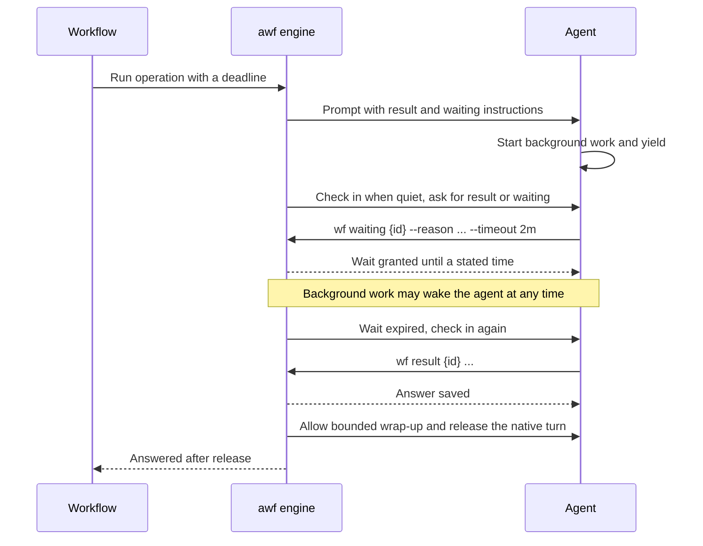

# Turn liveness and limits

## The problem

In the first AIRS-1515 run, the worker started a deploy watch in the background and ended its
turn, expecting the watch to wake it. awf saw an idle pane and nudged it to submit a result.
The agent said it was still waiting. awf then returned `unanswered` and closed the run, killing
the watch. An hour and $18.29 at list prices had been spent, with the work one step from done.

An idle agent has not necessarily finished the operation. It needs a way to tell awf that it
is waiting, and awf needs a bounded way to ask again.

## What changes

The agent uses the same operation ID for both commands:

```sh
wf waiting {id} --reason "Deploy is still running" --timeout 2m
wf result {id} '{"status":"deployed"}'
```

`waiting` asks for time until the next check-in. `result` submits the answer. Waiting never
counts as a result, and never extends the operation's deadline.

awf acknowledges a waiting request with the granted check-in time and the hard deadline.
A check-in is a follow-up prompt asking for a result or another waiting request. If no answer
arrives, awf checks in again. A responsive agent can repeat this
until the deadline. An agent that stops responding gets a shorter response window, then awf
stops its work within the authority it has.

**This is a cooperative protocol.** awf does not discover background tasks, prove that a wait
is necessary, or verify the reason the agent gives. The hard deadline bounds even a mistaken
or endlessly responsive agent.

## How it works



The agent may report waiting proactively, without receiving a nudge first. The command returns
immediately; it does not sleep, schedule a native wake-up, or keep a shell tool running.

## Scope

In scope:

- `wf waiting {id} --reason {text} [--timeout {duration}]` on the existing agent control channel.
- Repeated, sequential check-ins for `agent.run`, with one operation, result slot and deadline.
- Bounded response, delivery, persistence and release, with honest progress and records.
- Existing local and sandboxed placements, measured separately. No task list is required.

Out of scope:

- Native task registries, notification-consumption tracking, cron discovery and task ownership inference.
- A new author-facing inactivity option, live spend limits or durable recovery after engine death.
- Implementing remote execution or a network control plane. See [[workflow-in-sandbox]].
- A guarantee that every background or external job has stopped when an answer is returned.

## Design

### 1. The engine owns the conversation

One operation can contain several native model turns. Its slot stays open across idle gaps,
waiting acknowledgements and check-ins. A native turn completing is an opportunity to check
in, not an `unanswered` operation by itself.

The engine owns the waiting policy and timers. The harness owns prompt delivery, native turn
lifecycle and cancellation. `wf` parses the command and sends a request; it owns no timer.
Native task IDs and provider-specific task events never enter the engine's policy.

The operation holds its logical agent's queue position until a terminal outcome and release.
Later turns, settings changes, forks and compactions cannot take over between check-ins.
Other independent workflow branches remain free to run.

### 2. A waiting request grants one interval

`--reason` is required, non-blank, and bounded to 2 KiB of UTF-8. It is untrusted display text:
render it safely and do not put secrets in it. `--timeout` is optional; accept a positive integer
with `ms`, `s`, `m` or `h`, reject overflow, and convert it to milliseconds on the wire.

Admission uses the same connection-derived agent identity and operation ID as `wf result`.
Reject unknown IDs, another agent's ID, malformed requests, and operations already answered,
stopped or expired. A waiting request does not run the result schema or semantic validator and
does not create a candidate answer.

For an admitted request:

1. Apply the minimum interval, then cap the requested duration by the remaining operation time.
   Compute `waitUntil` using engine time, never a timestamp supplied by the agent.
2. Record the reason, admission time and actual grant.
3. Acknowledge the grant to the agent and show it in progress.
4. Suppress automatic check-ins until `waitUntil`, unless a terminal event wins first.

Waiting updates take effect in engine admission order. The client does not automatically retry
an uncertain submission. If its acknowledgement is lost, the command reports uncertainty; a
subsequent invocation is a new declaration and can replace the current wait, always within the
same hard deadline. Two deliveries of the same declaration may therefore change the grant.
This protocol does not promise command deduplication or reject an older declaration from the
same still-open operation. No native task ID or delivery token is required.

Waiting and result admission share one serialized operation transition. If a result is admitted
first, waiting is rejected. If waiting wins first, a later valid result is still accepted at once.
Cancellation and expiry also close admission through this transition. A slow or failed durable
write has a bounded failure path; it cannot hold shutdown indefinitely.

### 3. Check in without overlapping awf prompts

The initial prompt and every check-in explain both commands, the operation ID and the fixed
deadline. Check-ins say: submit the result, or report what you are waiting for and how long.
They also remind the agent to finish or stop work needed for its answer before submitting it.
A custom nudge prompt is additional context; it cannot remove these protocol instructions.

The loop has four non-terminal states:

| State | What awf does | What advances it |
| --- | --- | --- |
| Working | Wait for the active native turn or a protocol command | Result, waiting, native completion, failure or deadline |
| Quiet without a wait | Allow a short quiet interval | Activity resumes, a command arrives, or a check-in becomes due |
| Waiting until a stated time | Display the reason and suppress check-ins | Result, a renewed wait, a terminal event, or the grant expires |
| Check-in due / awaiting reply | Deliver at most one check-in, then wait for `waiting` or `result` | A protocol reply, delivery failure, response expiry or deadline |

A wait expiring makes a check-in **due**. It does not authorize typing into an arbitrary active
terminal. The harness must deliver through a supported serialized prompt path: a native turn
boundary or a measured provider queue. Recheck operation state before dispatch. Keep at most
one delivery pending, and cancel an undispatched check-in if a fresh wait or result arrives.

If the agent is already working when the wait expires, defer the check-in until delivery is
supported. After dispatch, allow 30 seconds to confirm that the provider accepted the input.
A native queue entry ends that transport grace; queued input may then wait for model receipt
under the fixed operation deadline. Start the two-minute response window only after linked
model output confirms receipt, never from a timer, queue acceptance or CLI success. Input with
unknown acceptance fails when its grace expires and is not blindly resent. A waiting request
or result received during confirmation satisfies the check-in directly.

An admitted waiting request or result satisfies the check-in. It cancels the response and
delivery-confirmation timers and invalidates that cycle. Late confirmation cannot start another
timer or fail an already satisfied check-in. Use internal generations for timer and delivery
callbacks; these are not tokens the agent must supply. Ordinary prose, tool output and screen
redraws do not satisfy a check-in. Ending the response turn without either command does not immediately
close the slot: allow the rest of the response window for a late protocol reply. Do not send a
second unanswered check-in. A responsive waiting request is what permits another cycle.

Native background wake-ups can race with a check-in. We accept this interaction, while requiring
the provider to serialize foreground execution. We do **not** claim that the session has no
other wake sources. A check-in already delivered cannot be retracted; any later duplicate
result still encounters the same one-answer slot.

### 4. One hard deadline, small internal intervals

The existing `timeoutMs` or absolute deadline, capped by the workflow scope and run, becomes
the bound for the **whole operation**, including all check-ins and waiting grants. Compute it
once before joining the agent queue, preserving the existing `run()` behavior: queue time
consumes this budget. Waiting, activity and nudges never move it.

Initial internal policy, with its evidence and limits in [[021-implementation-proof]]:

| Interval | Default | Meaning |
| --- | --- | --- |
| Quiet interval / minimum check-in spacing | 30 seconds | Grace after native completion and a floor on requested waits to avoid rapid paid loops |
| Waiting grant without `--timeout` | 2 minutes | Time until the next check-in is due |
| Response window | 2 minutes | Time after confirmed check-in delivery to submit either command |
| Unknown delivery acceptance / native release | 30 seconds each | Dispatch-to-acceptance grace; separate bounded natural release |

These are internal policy values, injectable into deterministic tests, not new author knobs.
Each interval is capped by the remaining operation time. Release after an on-time answer has
its own bounded grace; the operation's answer deadline no longer times out that answer while
it is being saved or released. Scope/run cancellation and shutdown bounds still apply.

At an exact deadline, expiry wins admission (`now >= deadline`). On waking after system sleep,
check the hard deadline before processing timers or dispatching another prompt. Never emit a
burst of missed check-ins. [[run-through-sleep]] owns the broader sleep policy.

There is no separate first-attempt deadline followed by a later nudge deadline. Remove the
current `laterDeadline(operationDeadline, nudgeDeadline)` result window. For compatibility,
include an existing `nudge.deadline` in the initial minimum of all deadlines: a later value
cannot extend the operation, and an earlier value shortens the **whole operation**, including
initial foreground work. Compute this once before queueing and show it in prompts and waiting
acknowledgements. This deliberately changes the old recovery-only meaning; update documentation,
existing call sites and tests together. There is no second recovery clock or hidden cutoff.

`nudge: false` disables automatic check-ins. Proactive waiting is still accepted and holds the
operation open through its granted interval. Once that interval expires and the agent is idle,
no check-in is sent and the operation ends `unanswered`; active native work remains bounded by
the operation deadline. Without any waiting request, keep the existing no-nudge completion rule.
The caller-session default that disables nudges when operator interrupts cannot be recognized
remains in force.

### 5. Answer admission and release are separate

After validation, the slot checks the fixed deadline and stop state inside its serialized
transition. Record `admittedAt` there. An admitted write may finish after the answer deadline;
record persistence completion separately. Admission cancels **all answer-wait timers** immediately,
including quiet, waiting and response timers; do not wait for the write to finish. Saving gets
its own finite bound. A stop during saving or release can still prevent
workflow success. Late completion cannot change an already published terminal outcome.

Admission starts bounded release handling immediately, so persistence crossing the answer
deadline cannot retrospectively invalidate an on-time submission. A saved answer is acknowledged
so the agent can finish its command and wrap up. Before returning `answered`, the engine awaits
native release. If a check-in was already dispatched, its input must be received before fresh
native completion can prove release; an earlier idle observation cannot discharge queued input.
`finishing` is an internal state,
not permission for the workflow to advance. If release cannot be confirmed in its grace, keep
the saved answer as evidence, fail with `cleanup-unresolved`, stop starting new operations in this run and perform
bounded teardown. Do not retry that operation automatically.

**Release confirms that the native turn finished or was stopped**, plus any execution scope
actually stopped by its owner. Without task observation or
isolated containment, this is not proof that a dev server, detached child or remote deployment
has stopped. The prompt asks the agent to finish answer-related work before `wf result`; that
is a cooperative obligation, not a machine-verified fact.

- For a run-owned agent, use the existing harness and sandbox owner to stop what they own when
  termination is needed. Prefer an owned process group or occupant boundary over task discovery.
- Do not close a shared sandbox just to stop one operation. Occupants are per agent, and releasing
  one may also end that agent's ability to continue. Do not destroy session continuity on every
  successful answer. Task 1 records the actual guarantee for each placement.
- For a caller session, retain ADR 0010's authority: interrupt only the active turn awf delivered
  where allowed, never kill the pane or its tasks. After an accepted answer, do not add a
  stop-finishing interrupt. If natural wrap-up exceeds the bound, fail and hand back the session. Stopping an observer
  is not native release: the caller backend's `stopFinishing` may only stop watching. Do not
  interpret the resulting promise settlement as proof that the model stopped.

Waiting for native release before success changes the behavior allowed by
[[0008-a-pane-agent-continues-in-its-pane|ADR 0008]] and
[[0010-the-calling-session-is-an-agent|ADR 0010]]. Amend those decisions with the implementation.
Do not describe this as protecting a worktree from all background writes. Strong descendant
cleanup still depends on [[headless-orphans]] and measured provider containment.

### 6. Outcomes and records remain honest

| Event | Final outcome |
| --- | --- |
| Valid answer saved and native release confirmed | `answered` |
| Confirmed check-in receives neither command within its response window | `unanswered` |
| Hard deadline reached before answer admission | `timed-out` |
| Operator or scope cancels | `cancelled` |
| Confirmed permission or input prompt | `blocked` |
| Delivery/transport failure or unresolved release | `failed`, with the specific cause |

Cleanup failure can supersede
an intended successful or unanswered outcome; cancellation and timeout keep their original cause
with cleanup failure recorded alongside it. In every unresolved-cleanup case, stop starting new operations in this run.

Progress shows working, waiting with reason and check-in time, check-in pending, awaiting reply,
and releasing. Label reasons as agent-reported. Do not display invented task counts or claim that
the agent is healthy merely because it replied.

Keep one terminal `turns.jsonl` record per operation, including its nudges. Record waiting grants
and check-in delivery/replies separately from answer candidates and final turn outcomes. Include operation ID, check-in sequence, timestamps, effective bounds,
stop cause and release disposition. The separate optional file
`calls/{operationId}/liveness.jsonl` uses record version 1; existing turn and output versions stay
unchanged. Cap diagnostic records, queued bytes and flush time. Dropped records and truncated
reads are explicit informational gaps, never inputs to the control protocol. Usage covers all native turns under the operation, with no double counting.

`TurnOutcome` remains terminal. No `waiting` result variant is added to workflow schemas or
outcomes. OTel may export these events but is never required for operation progress.

## Code map and compatibility

| Area | Change |
| --- | --- |
| `packages/contract/src/wire.ts` | Separate waiting request/acknowledgement and runtime decoding, with explicit version-3 compatibility |
| `packages/wf/src/cli.ts`, `client.ts` | Parse waiting arguments, submit over the installed launcher, print the granted wait and report uncertain delivery |
| `packages/engine/src/control-plane.ts`, `result-slots.ts` | Route using connection authority and serialize waiting, answer admission and closure |
| `packages/engine/src/workflow-runner.ts`, `operation-liveness.ts` | Own the loop and fixed deadline, hold one slot across check-ins, await native release |
| `packages/engine/src/operation-events.ts` | Bound optional diagnostic writes and read incomplete streams honestly |
| `operationPrompt` in `packages/engine/src/workflow-runner.ts` | Include both commands in initial and recovery prompts |
| `packages/harness/src/session-core.ts`, `adapter.ts`, adapters | Permit sequential successor check-ins, preserve binding and lifecycle, measure delivery and release |
| `packages/contract/src/records.ts`, engine progress and workflow-testing | Record and script waiting/check-in events without changing final answer schemas |

`HarnessTurn.delivery` now separates dispatched input, native acceptance and linked model
receipt. Host Claude panes, SRT Claude panes and the fake currently advertise cooperative waiting.
The Claude reader baselines transcripts before dispatch and keeps provider-specific ancestry
inside the harness. Cached session status and acquisition timestamps are not receipt evidence.

Each native handle permits one successor, including a successor of a check-in. The engine holds
the newest handle and numbers check-ins. The per-handle duplicate guard remains; `deliver()` is
not repurposed into a generic messaging API.

`AgentRef.enqueue` currently returns an unavailable error. It and manual `TurnRef.nudge` remain
out of scope. Their declared future contracts must not be mistaken for implemented callers of
this loop. No new public harness capability or author option ships without its implementation
and consumer (ADR 0001).

Use wire version 3 with explicitly discriminated result and waiting requests and their separate
acknowledgements. Keep the `wf result` CLI signature unchanged. The engine installs its matching
client and launcher; old clients receive an unsupported-version error rather than having their
request guessed. Both ends are implemented together; the installed SRT launcher and control forwarding have passed a complete workflow run.

For future remote execution, waiting uses the same route as results. The engine need not inspect
a remote process tree or read provider task files. Today the foundation keeps the engine beside
its agents; a local Unix socket is not a new network API. Existing sandbox door forwarding must
carry both commands and return the same acknowledgement semantics.

## Evidence

- [[turn-liveness-and-limits|Source research]] maps native lifecycle signals and their limitations.
- [[021-liveness-probe|Claude lifecycle probe]] observed a running task and an empty registry
  **before** the agent consumed the completion notification. This explains why task emptiness
  cannot decide when a nudge is harmless. The probe used persistent print mode, not a pane.
- [[021-result-ordering-probe|Result ordering probe]] proved that a write admitted inside the slot
  transition can finish after a queued close. The design retains explicit admission ordering.

- [[021-implementation-proof|Implementation proof]] records five host-pane probes, exact UTC
  timings, reported cost, the support boundary and focused test results. The intended 40-second
  wait was blocked by Claude and is explicitly inconclusive for a long queue.

Host and SRT complete `awf run` acceptance cases measured two check-ins, an answer and a
same-session follow-up. Silence, hard timeout, cancellation and lost-result-route checks passed.
Final minimum-review, host/SRT acceptance and Claude caller checks passed after the complete
prompt-submission correction. Cursor-dependent
full matrices remain blocked by authentication; earlier registry-based requirements are superseded.

## Tasks

### Tasks at a glance

- [x] 1. Prove delivery and settle the compatibility plan.
- [x] 2. Implement waiting from CLI to engine acknowledgement.
- [x] 3. Implement the bounded check-in loop.
- [x] 4. Finish release, records and progress.
- [x] 5. Prove the full workflow and publish placement support.

### Open questions

None. The implementation and compatibility choices are settled.

### Final handoff

Tasks 1–5 passed focused verification and independent review. The final offline suite passed
**1,387 tests**, with **2 skipped**, **0 failures** and **4,807 assertions**. Repository checks,
including typecheck and package boundaries, passed. Live checks cover host/SRT repeated waiting,
release before follow-up, silence, timeout, cancellation, lost result route, minimum-review and
supported caller hand-back. [[021-implementation-proof]] records the commands, costs and artifacts.

The global Cursor-dependent live matrices remain blocked by authentication. Those cases are
not claimed as passes, and human approval remains outstanding. A live queue exceeding
30 seconds remains unmeasured; deterministic tests cover that timing rule.

### 1. Prove the delivery seam and write the compatibility plan

Start here. Use small fixtures and bounded probes, without publishing speculative types.

- Trace `agent.run`, caller and scripted workflow behavior. Keep unimplemented enqueue/manual
  nudge APIs out of scope. Inventory
  existing custom nudge deadlines and prompts; specify their migration to the fixed bound.
- Exercise two sequential successor prompts against the current Claude pane path, including a
  native wake-up while a check-in becomes due. Confirm delivery from native evidence and verify
  that awf does not interrupt or duplicate the foreground turn. Record versions and placement.
- Write the minimal internal state/transition plan for engine timers and slot admission. Settle
  receipt-order waiting updates, v3 wire decoding, bounded event recording and old-reader behavior.
- Measure native wrap-up/release and document what the harness, process group and sandbox
  occupant can actually stop. Include caller hand-back. Do not require task-registry coverage.
- Validate the internal interval defaults and choose the concrete delivery/release bounds.

**Done when:** the seam supports the protocol for at least one production placement, the public
compatibility choices are written down, and the support matrix names limitations explicitly.
If a placement cannot serialize prompts, leave its new automatic loop unsupported rather than
quietly switching its transport. This gate precedes changes to published contracts.

### 2. Implement waiting end to end

Add wire decoding, CLI, control-plane routing, serialized admission and acknowledgements together.
Keep the live operation's waiting state in the engine. Include initial prompt instructions and
scripted workflow support in this slice so the command has a real consumer.

**Done when:** a fake workflow reports waiting, gets a capped grant, and then submits its answer;
wrong-agent/stale/closed/expired requests fail; malformed durations and oversized reasons fail;
repeated and delayed same-operation declarations follow admission order; waiting never creates
an answer or moves the hard deadline. Cover sandbox door forwarding and connection failure.

### 3. Implement the bounded check-in loop

Keep the operation open across native completions. Replace the one-nudge runner with sequential
check-ins and one immutable result deadline. Add confirmed-delivery response windows and remove
all timers and pending delivery on terminal transition.

**Done when deterministic tests cover:**

- Proactive waiting and waiting in reply to a check-in, with several renewals and one final answer.
- A silent agent, a responsive agent that never finishes, `nudge: false`, and earlier/later legacy nudge deadlines normalized into the fixed bound.
- Native activity resuming while a check-in is due, one pending delivery, and no overlapping awf prompts.
- Waiting/result/cancel/expiry at the same instant, delayed validation and delayed persistence.
- Exact-deadline rejection, late delivery, an acknowledgement lost in transit, and stale timers
  from an earlier grant or operation. Old timer generations cannot expire a renewed wait.
- Busy work remains bounded by the hard deadline; sleep does not trigger a burst of check-ins.

### 4. Finish release, records and progress

Await bounded native wrap-up before returning success. Preserve the accepted answer if cleanup
fails. Apply caller authority limits, stop run admission on unresolved cleanup, and retain final
outcomes once published. Update foundation, ADRs and author documentation for repeated recovery,
the fixed deadline and the narrower release guarantee.

**Done when:** no later operation on that agent begins during release; cancellation during saving
or release prevents success; a hung write or release cannot hang shutdown; delayed callbacks
cannot resurrect an operation; progress and persisted records explain the same outcome; usage
includes every check-in; and supported old records still read correctly.

### 5. Run the complete workflow and publish support

Run a throwaway workflow through `awf run`: background work, waiting acknowledgement, at least two
check-ins, final answer, bounded wrap-up and a following operation. Also run silence, hard-timeout
and cancellation cases. Exercise one existing sandbox placement through its installed `wf`
launcher, including loss of the result route. Verify native evidence and records.

**Done when:** the harness/version/placement matrix records confirmed delivery, waiting support,
release guarantees and caller restrictions; focused live probes and offline checks pass; status,
workflow docs and testing guidance match. Unsupported remote execution remains out of scope.

For every implementation task, write its focused plan, implement with meaningful tests, obtain
read-only architecture and correctness subagent reviews, and address their findings before moving
on. The story is complete only after the full workflow proof and human review.

## Verification

Use fake clocks and injected persistence for timers and admission races, not sleeps. Run focused
CLI, wire, slot, runner, session-core, sandbox door and workflow-testing tests, then `bun test` and
`bun run check` once the implementation is complete.

Live probes follow [[testing]]: bounded time and spend, isolated settings, explicit cleanup,
redacted traces and recorded versions/cost. The old Claude probe is supporting evidence, not a
passing test for this new design. The expensive ticket workflow is a final check, not a regression
fixture. Mermaid syntax in this document must also parse in the supported renderer.

## Dependencies and readiness

- [[herdr-pane-settlement]] shares prompt-delivery and native release measurements.
- [[headless-orphans]] owns stronger descendant cleanup; do not claim it from native completion.
- [[run-logs-and-telemetry]] and [[operator-run-observation]] can consume waiting/check-in events.
- [[stopped-run-recovery]] may later reuse an open operation; it cannot reopen a closed slot.
- [[live-spend-limits]] remains separate. [[018-workflow-stages]] is not a prerequisite.

**Implementation and story verification are complete.** Tasks 1–5 passed their review gates.
The story remains `in-progress` for human review and the explicitly incomplete global
Cursor-dependent matrix. Exact results and limitations are in
[[021-implementation-proof#Broader verification checkpoint]].

The current support boundary is Claude 2.1.289 panes on the host and in SRT, plus the fake.
Caller and other providers retain their explicit restrictions.
See [[021-implementation-proof#Current support boundary|the support table]] for the distinction
between measured transport behavior and complete workflow support.

## Review record

The earlier reviews established two constraints retained here: answer admission needs an explicit
ordering point, and returning an answer before native release can overlap the next workflow step.
Their stronger claim about stopping all background work no longer applies.

The cooperative revision received read-only architecture, correctness and readability reviews:

- Reuse sequential native-turn handles rather than adding a generic messaging API.
- Keep unimplemented `enqueue` and manual nudge APIs outside this story.
- Use wire v3 explicitly and admission-order waiting updates without automatic transport retry.
- Add minimum check-in spacing and invalidate stale timers and delivery confirmations.
- Preserve caller interrupt restrictions and state the narrower native-release guarantee.
- Keep task 1's open proofs visible, with a task checklist and an explicit readiness boundary.

Implementation reviews additionally caught cancellation/admission ordering, late-acquisition
cleanup, receipt-before-release and exact admission-timestamp races. Accepted fixes and their
focused evidence are recorded in [[021-implementation-proof#Review findings and dispositions]].
The implementation proof separates completed story checks from Cursor-dependent full matrices
blocked by authentication. Human approval has not been given; the story is not marked done.

## Human review

- [ ] All implementation tasks and story-level verification pass.
- [ ] Present the outcome, review findings, verification evidence and remaining limitations.
- [ ] Mark `done` only after explicit human approval; update the index and status then.
